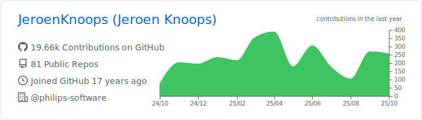
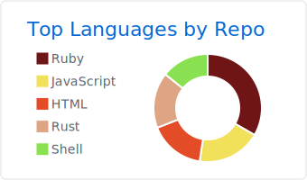
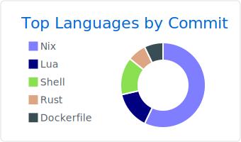

My name is Jeroen Knoops. I work as a Computer.nerd at Philips Research.

- 🔭 I’m currently working on Software Bill of Material and promoting open and inner source within Philips.
- 🌱 I’m currently learning Rust-lang.
- 💬 Ask me about sourdough bread, brewing beer, synthesizers and drum-computers
- 📫 How to reach me: That should not be too hard
- ⚡ Fun fact: I love the following number sequences: 101, 202, 303, 606, 707, 727, 808 and 909

### Languages & Tools 🛠  

### Analytics ⚙️

<!-- 

  
  
  

 -->

### Let's connect? 🤝

<table><tbody><tr><td>  </td></tr></tbody></table>
